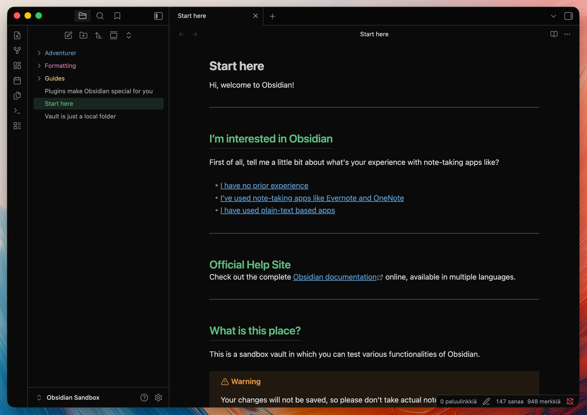

# Pastel Noir

A dark Obsidian theme with pastel accents.

> **Dark mode only** — this theme is designed for Obsidian's dark base color scheme (Settings → Appearance → Base color scheme → Dark).

## Features

- **Unified dark background** — near-black base across all UI areas
- **Pastel folder colors** — top-level and second-level folders get unique colors, deeper levels stay gray
- **Colored breadcrumbs** — path bar matches folder color hierarchy
- **Pastel headings** — each heading level has its own color
- **Flat tabs** — no rounding, minimal borders, clean look
- **Centered sidebar buttons** — Files, Search, Bookmarks centered in their container
- **Brighter icons and muted text** — improved readability over default dark themes

## Credits

Inspired by [Things](https://github.com/colineckert/obsidian-things) by Colin Eckert.
